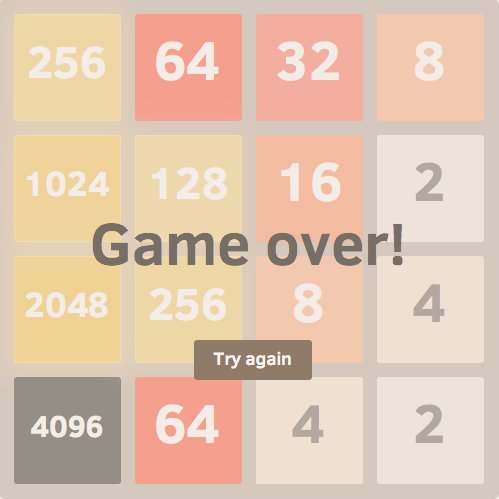

# 8192
A mod of [2048](https://gabrielecirulli.github.io/2048/). Which is based on other similar puzzles.

Why this modification? You may be able to always get to the 4096 tile, but getting to 8192 is harder, so instead of the tedium to set up the 4096 tile, this version lets you start from there.
 

[Play it here!](http://frazer.github.io/8192/)

### Contributions

To see the team who contributed to the https://gabrielecirulli.github.io/2048/, see that repository for an up to date list. 

### Screenshot

  

:smile:

## License
8192 is licensed under the [MIT license.](https://github.com/frazer/8192/blob/master/LICENSE.txt)

## Donations
The game was made by Gabriel, so if you enjoyed the game and feel like supporting him, you can donate to his BTC address: `1Ec6onfsQmoP9kkL3zkpB6c5sA4PVcXU2i`. If you really appreciate this mod, you can contribute to me via PayPal at frazer@frazerk.net - Thank you very much!
